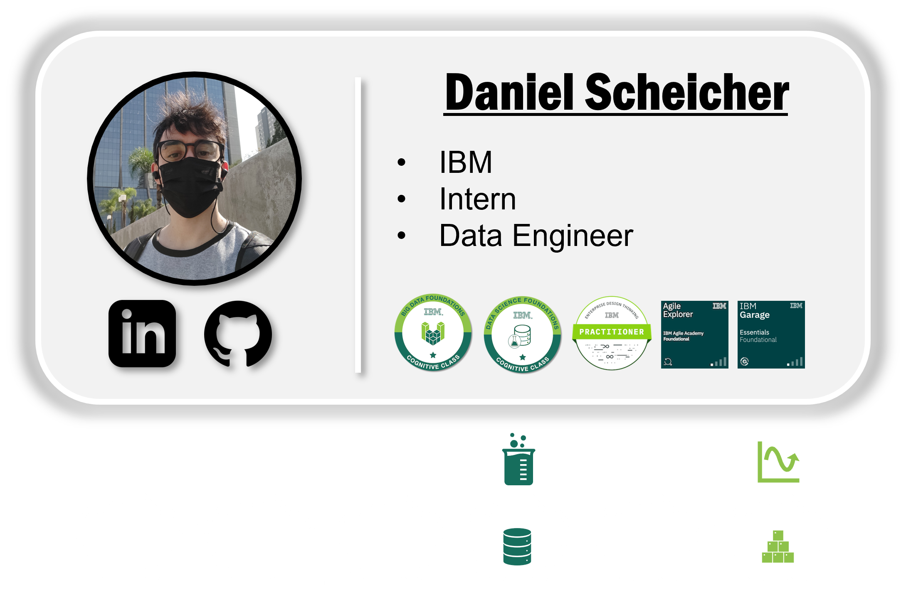

<!-- ------------------------- Running Presentation Text --------------------------------- -->
<table>
    <!-- row -->
    <tr>
        <td>
            <!-- line -->
            
        </td>
    </tr>
    <!-- row -->
    <tr>
        <!-- titulo -->
        <td>
            <!-- running text -->
            

            
            

        </td>
    </tr>
    <!-- row -->
<!-- -----------------------------------Project Directories-------------------------------- -->
    <!-- row -->
    <tr>
        <td>
            <!-- line -->
            
        </td>
    </tr>
    <!-- row -->
    <tr>
        <!-- titulo -->
        <th>
            <h1 align="center" style="font-weight:1000">:open_file_folder: My Projects Directories</h1>
        </th>
    </tr>
    <!-- row -->
    <tr>
        <td>
            <!-- line -->
            
        </td>
    </tr>
    <!-- row -->
    <tr>
        <!-- coluna -->
        <td align="center">
            <!-- a project icon -->
            
        </td>
    </tr>
    <!-- row -->
    <tr>
        <!-- coluna -->
        <td align="center">
            <!-- a project icon -->
            
        </td>
    </tr>
</table>

<!-- ------------------------------------- SKILLS ----------------------------------------- -->
<table>
    <!-- row -->
    <tr>
        <td>
            <!-- line -->
            
        </td>
    </tr>
    <!-- row -->
    <tr>
        <!-- titulo -->
        <th>
            <h1 align="center" style="font-weight:1000"> Skills</h1>
        </th>
    </tr>
    <!-- row -->
    <tr>
        <td>
            <!-- line -->
            
        </td>
    </tr>
    <!-- row -->
    <tr>
        <!-- column -->
        <td>
            <h2 align="left" style="font-weight:900">:diamond_shape_with_a_dot_inside: Python:
            <a href="https://ibm-learning.udemy.com/certificate/UC-f796b0de-fc12-4941-99b5-5fe8b77b1202/">:file_folder:</a>
            <a href="https://github.com/DanScherr/learning-courses/tree/main/python">:memo:</a>
            </h2></li>
        </td>
    </tr>
    <!-- row -->
    <tr>
        <!-- column -->
        <td>
            <h5 align="center" style="font-weight:600">:small_blue_diamond: POO; 
            <a href="https://github.com/DanScherr/ibm-school-of-data_engineering/tree/main/2-programacao-orientada-a-objetos">:file_folder:</a>
            <a href="https://ibm-learning.udemy.com/certificate/UC-f796b0de-fc12-4941-99b5-5fe8b77b1202/">:memo:</a>
            </h2></li>
        </td>
    </tr>
    <!-- row -->
    <tr>
        <!-- column -->
        <td>
            <h5 align="center" style="font-weight:600">:small_blue_diamond: Flask (API);
            <a href="https://github.com/DanScherr/learning-courses/tree/main/python/api-restful">:file_folder:</a>
            <a href="https://ibm-learning.udemy.com/certificate/UC-d48992b0-cadc-4888-a462-2b8129b1a7ee/">:memo:</a>
            </h2></li>
        </td>
    </tr>
    <!-- row -->
    <tr>
        <!-- column -->
        <td>
            <h5 align="center" style="font-weight:600">:small_blue_diamond: PySpark (Big Data);
            <a href="https://github.com/DanScherr/learning-courses/tree/main/spark">:file_folder:</a>
            <!-- <a href="https://ibm-learning.udemy.com/certificate/UC-d48992b0-cadc-4888-a462-2b8129b1a7ee/">:memo:</a>
            </h2></li> -->
        </td>
    </tr>
    <!-- row -->
    <tr>
        <!-- column -->
        <td>
            <h5 align="center" style="font-weight:600">:small_blue_diamond: - Pandas, Numpy, Matplotlib, etc. (Data Analisis).
            <a href="https://github.com/DanScherr/ibm-school-of-data_engineering/tree/main/1-python">:file_folder:</a>
            <!-- <a href="https://ibm-learning.udemy.com/certificate/UC-d48992b0-cadc-4888-a462-2b8129b1a7ee/">:memo:</a>
            </h2></li> -->
        </td>
    </tr>
    <!-- row -->
    <tr>
        <!-- column -->
        <td>
            <h2 align="left" style="font-weight:900">:diamond_shape_with_a_dot_inside: SQL:
            <a href="https://github.com/DanScherr/ibm-school-of-data_engineering/tree/main/5-SQL">:file_folder:</a>
            <a href="https://yourlearning.ibm.com/certificate/URL-1498111204378">:memo:</a>
            </h2></li>
        </td>
    </tr>
    <!-- row -->
    <tr>
        <!-- column -->
        <td>
            <h2 align="left" style="font-weight:900">:diamond_shape_with_a_dot_inside: Data Modelling:
            <a href="https://yourlearning.ibm.com/certificate/URL-1498111204378">:memo:</a>
            </h2></li>
        </td>
    </tr>
    <!-- row -->
    <tr>
        <!-- column -->
        <td>
            <a href="">
            <h5 align="center" style="font-weight:600">:small_blue_diamond: Faixa Cinza Programa Judoca de Modelagem do Itau Unibanco;</h2></li>
            </a>
        </td>
    </tr>
    <!-- row -->
    <tr>
        <!-- column -->
        <td>
            <h5 align="center" style="font-weight:600">:small_blue_diamond: MER & DER;</h2></li>
        </td>
    </tr>
    <!-- row -->
    <tr>
        <!-- column -->
        <td>
            <h5 align="center" style="font-weight:600">:small_blue_diamond: Data Normalization;</h2></li>
        </td>
    </tr>
    <!-- row -->
    <tr>
        <!-- column -->
        <td>
            <h2 align="left" style="font-weight:900">:diamond_shape_with_a_dot_inside: Docker:
            <a href="https://github.com/DanScherr/ibm-school-of-data_engineering/tree/main/4-docker">:file_folder:</a>
            <a href="https://ibm-learning.udemy.com/certificate/UC-216782a4-a714-4942-892e-646f52dbd271/">:memo:</a>
            </h2></li>
        </td>
    </tr>
    <!-- row -->
    <tr>
        <!-- column -->
        <td>
            <h5 align="center" style="font-weight:600">:small_blue_diamond: Docker Compose;
            <a href="https://github.com/DanScherr/learning-courses/tree/main/docker/4-Docker-Compose">:file_folder:</a>
            </h2></li>
        </td>
    </tr>
    <!-- row -->
    <tr>
        <!-- column -->
        <td>
            <h5 align="center" style="font-weight:600">:small_blue_diamond: SWARM;
            <a href="https://github.com/DanScherr/learning-courses/tree/main/docker/5-swarm">:file_folder:</a>
            </h2></li>
        </td>
    </tr>
    <!-- row -->
    <tr>
        <!-- column -->
        <td>
            <h5 align="center" style="font-weight:600">:small_blue_diamond: Kubernetes;
            <a href="https://github.com/DanScherr/learning-courses/tree/main/docker/6-kubernetes">:file_folder:</a>
            </h2></li>
        </td>
    </tr>
    <!-- row -->
    <tr>
        <!-- column -->
        <td>
            <h2 align="left" style="font-weight:900">:diamond_shape_with_a_dot_inside: Cloud:
            <a href="https://yourlearning.ibm.com/certificate/URL-C696CACAB3FB">:memo:</a>
            </h2></li>
        </td>
    </tr>
    <!-- row -->
    <tr>
        <!-- column -->
        <td>
            <h5 align="center" style="font-weight:600">:small_blue_diamond: Aws;</h2></li>
        </td>
    </tr>
    <!-- row -->
    <tr>
        <!-- column -->
        <td>
            <h5 align="center" style="font-weight:600">:small_blue_diamond: Ibm DB2;
            <a href="https://github.com/DanScherr/ibm-school-of-data_engineering/tree/main/7-connect-to-db2">:file_folder:</a>
            </h2></li>
        </td>
    </tr>
    <!-- row -->
    <tr>
        <!-- column -->
        <td>
            <h2 align="left" style="font-weight:900">:diamond_shape_with_a_dot_inside: CI/CD:</h2></li>
        </td>
    </tr>
    <!-- row -->
    <tr>
        <!-- column -->
        <td>
            <h5 align="center" style="font-weight:600">:small_blue_diamond: GitHub;
            <a href="https://github.com/DanScherr/GitStart">:file_folder:</a>
            <a href="https://ibm-learning.udemy.com/certificate/UC-4a5ed0c6-77c6-4c68-9900-2780efb6dcac/">:memo:</a>
            </h2></li>
        </td>
    </tr>
    <!-- row -->
    <tr>
        <!-- column -->
        <td>
            <h2 align="left" style="font-weight:900">:diamond_shape_with_a_dot_inside: SOs:</h2></li>
        </td>
    </tr>
    <!-- row -->
    <tr>
        <!-- column -->
        <td>
            <h5 align="center" style="font-weight:600">:small_blue_diamond: Linux (flavor: Ubuntu);</h2></li>
        </td>
    </tr>
    <!-- row -->
    <tr>
        <!-- column -->
        <td>
            <h5 align="center" style="font-weight:600">:small_blue_diamond: Windows;</h2></li>
        </td>
    </tr>
</table>

<!-- ------------------------------- GITHUB ACTIVITY------------------------------------- -->
<table>
    <!-- row -->
    <tr>
        <td>
            <!-- line -->
            
        </td>
    </tr>
    <!-- row -->
    <tr>
        <!-- titulo -->
        <th>
            <h1 align="center" style="font-weight:1000">:chart_with_upwards_trend: GitHub Activity</h1>
        </th>
    </tr>
    <!-- row -->
    <tr>
        <td>
            <!-- line -->
            
        </td>
    </tr>
    <!-- row -->
    <tr>
        <!-- coluna -->
        <td align="center">
            <!-- git stats -->
            
        </td>
    <tr>
        <!-- coluna -->
        <td align="center">
            <!-- most common languages -->
            
        </td>
    <!-- row -->
    </tr>
</table>

<!-- ------------------------------------------------------------------------------------ -->
<table>
    <!-- row -->
    <tr>
        <td>
            <!-- line -->
            
        </td>
    </tr>
    <tr>
        <th>
            <h1 align="center" style="font-weight:1000">:handshake: Feel free to get in touch</h1>
        </th>
    </tr>
    <!-- row -->
    <tr>
        <td>
            <!-- line -->
            
        </td>
    </tr>
    <tr>
        <td align="center">
            
        </td>
    </tr>
</table>
